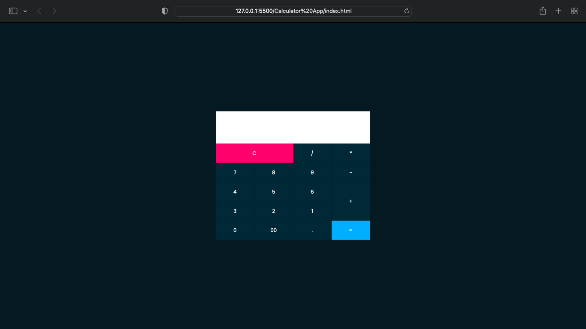

# Calculator App
> A simple calculator App

This is a simple calculator App made With HTML and CSS with an onclickEvent from Js. This App was motivated by Onlinetutorials4Design.




## Usage example

This was make without a Js Script whereby the script was written inside the Css. So making it very light weight.

This is how the text area was created
```sh
<input type="text" name="txt" class="value" readonly="">
```
This how the inputs were called so making it easy to get value from the HTML without using the traditional EventListener Calls in Js 
```sh
        <span class="num" onclick="document.calc.txt.value +='9'">9</span>
```


## Development setup

This is compatible with all web Browser.It was created with HTML% and CSS3.


## Meta

Adefila Mustapha – [@Adeope63](https://twitter.com/adeope63) – Adeope63@gmail.com

Distributed under the XYZ license. See ``LICENSE`` for more information.

[https://github.com/adeope63/calculator-app](https://github.com/adeope63/calculator-app)

## Contributing

1. Fork it (<https://github.com/adeope63/calculator-app/fork>)